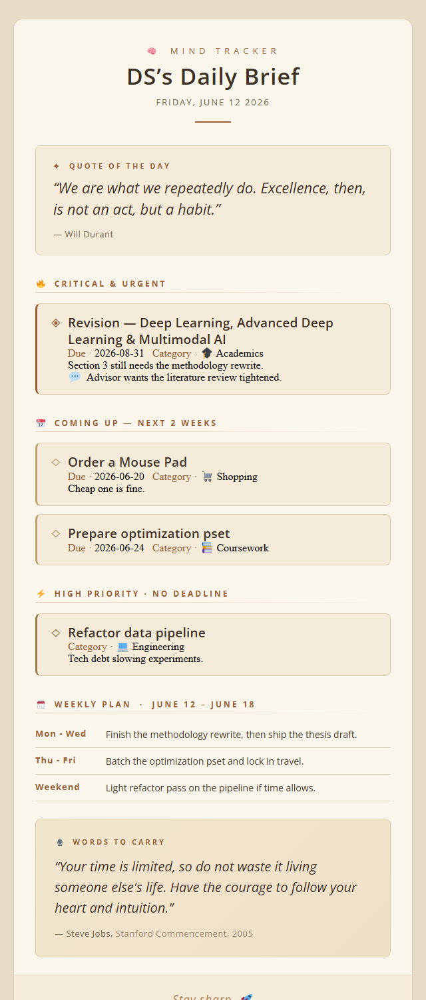

# Mind Tracker

Pulls critical and upcoming tasks from a Notion database, summarises them with GPT-4o-mini, and emails a formatted daily brief every two days.



---

## How it works

1. Queries the Notion task database for anything Critical, High priority, or due within the next 14 days
2. Fetches notes and comments for each task
3. Passes everything to GPT-4o-mini, which sorts tasks into buckets and writes a practical weekly plan
4. Renders the output as an HTML email (warm editorial design, Twemoji inline images) with a plain-text fallback
5. Sends it via Zoho SMTP

The model supplies only content — all HTML templating stays in Python.

---

## Setup

**1. Clone and install**

```bash
git clone https://github.com/YOUR_USERNAME/notion-mind-tracker.git
cd notion-mind-tracker
pip install -r requirements.txt
```

**2. Create a `.env` file**

```
NOTION_API_KEY=your_notion_integration_token
OPENAI_API_KEY=your_openai_key
ZOHO_API_KEY=your_zoho_app_password
```

**3. Run**

```bash
python summarizer.py
```

---

## GitHub Actions

The workflow fires every two days at 7 AM UTC. Add the three keys above as repository secrets under **Settings → Secrets → Actions**, then push — it runs automatically.

You can also trigger it manually from the **Actions** tab.

| Secret | What it is |
|--------|------------|
| `NOTION_API_KEY` | Notion integration token |
| `OPENAI_API_KEY` | OpenAI API key |
| `ZOHO_API_KEY` | Zoho app-specific password |

---

## Adapting it

The Notion database ID, email addresses, and task filter are all near the top of `summarizer.py`. The model prompt and bucket definitions are in `build_content()`.

## Stack

Python · Notion API · OpenAI API · Zoho SMTP · GitHub Actions
